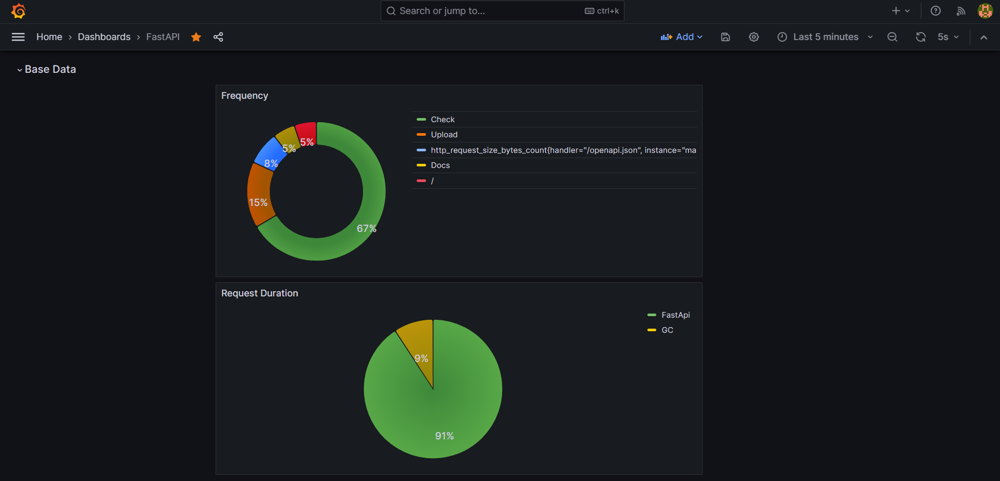
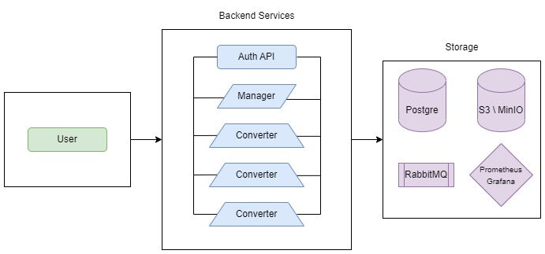
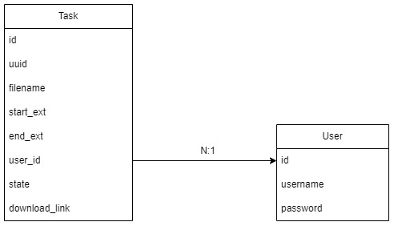
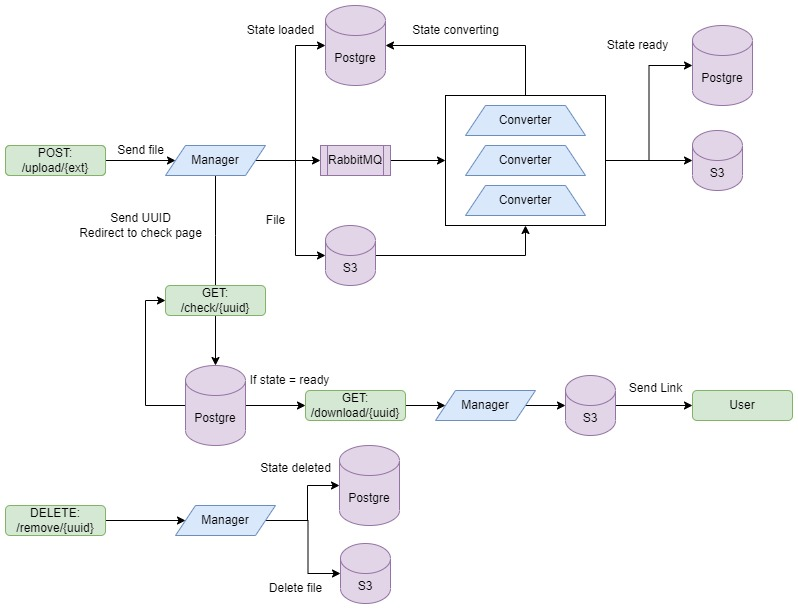

# Проект по распределенным системам

## Приложение для конвертации видео и аудио в разных форматах

Наприер можно извлечь аудиодорожку из видео

    mp4 -> mp3, wav

Или перекодировать видео для айфона

    mp4 <-> m4v <-> mov

# Description

## Приложение состоит из минимум 5 докер контейнеров(вы можете увеличить количество контейнеров которые будут конвертировать данные, в параметре 'replicas:2' в docker-compose.yml):

- postgres:15.3
- minio/minio:latest
- rabbitmq:3.12-management
- manager/
- converter-1/
- converter-2/
- prometheus
- grafana

Контейнеры manager и converter собираются локально

# How to deploy

Для запуска приложения неообходимо скопировать репозиторий, затем добавить переменные окружения как в файле 'example.env', только назвав его '.env'

Убедитесь что у вас установлен docker и docker-compose, затем выполните команду в корне проекта

```bash
docker-compose --compatibility up --build -d
```

Посмотреть простой веб интерфейс можно будет на адрессе http://127.0.0.1:8000/docs

# Metrics

## Вы можете получить метрики перейдя на http://localhost:3000/dashboards


Пример обработки метрик собранных с помощью Prometheus и визуализированных в Grafana

# Architecture



# Tables



# Processes



# Stack

В проекте используются такие библиотеки и технологии:

```
Python 3.11.3
FastApi
Pydantic
SQLAlchemy
RabbitMQ
S3 (MinIO) boto3
PostgreSQL
docker-compose
fffmpeg
Prometheus + Grafana
```
